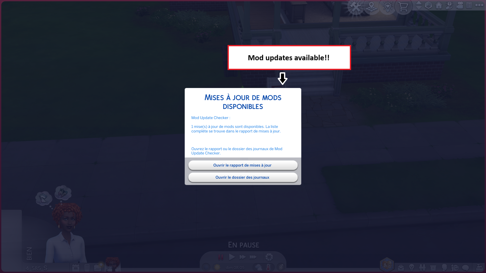
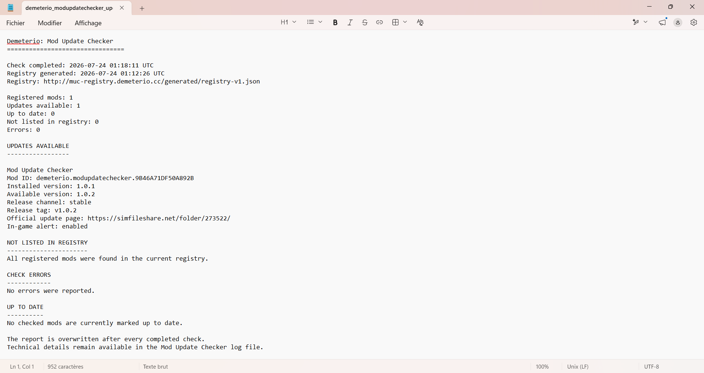
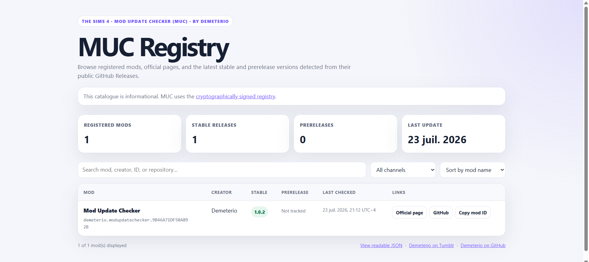
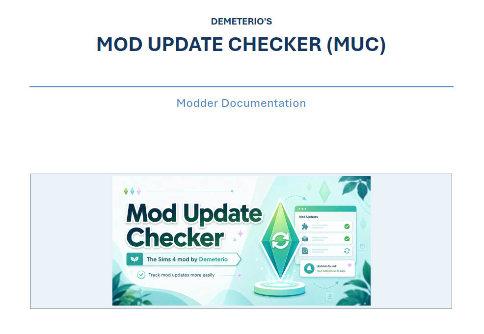

<a href="#"></a>


# Demeterio's Mod Update Checker

**Mod Update Checker**, or **MUC**, is a transparent update-notification framework for script and tuning mods made for **The Sims 4**.

MUC retrieves one signed public registry, compares it locally with declarations supplied by compatible installed mods, writes a readable report, and can display one summary notification when updates are available.

MUC does **not** download, install, import, replace, or execute mod files.

## Official links

| Resource | Link |
| --- | --- |
| Latest official release | [Download from GitHub Releases](https://github.com/Demeterio/Mod-Update-Checker/releases/latest) |
| Mod The Sims | [Official Mod The Sims page](#) |
| Creator blog | [Demeterio on Tumblr](https://demeterio.tumblr.com/) |
| Discord community | [Demeterio's Discord](https://discord.gg/mPyRPScgeS) |
| Public Python source | [`src/`](src/) |
| Public registry project | [Mod Update Checker Registry](https://github.com/Demeterio/Mod-Update-Checker_registry) |
| Registry contribution guide | [CONTRIBUTING.md](https://github.com/Demeterio/Mod-Update-Checker_registry/blob/main/CONTRIBUTING.md) |
| Registry Pull Requests | [Proposed registry changes](https://github.com/Demeterio/Mod-Update-Checker_registry/pulls) |
| Live signed registry | [registry-v1.json](http://muc-registry.demeterio.cc/generated/registry-v1.json) |
| Live registry catalogue | [Catalogue](http://muc-registry.demeterio.cc/registry/) |

> Download the mod only from an official link listed above.  
> GitHub's automatically generated **Source code** archives are not ready-to-install Sims 4 mod archives.

## Screenshots

<p align="center">
  
  
</p>

<p align="center">
  
  
</p>

## What MUC does

MUC is designed to:

- perform one registry request instead of one request per installed compatible mod;
- compare installed and available versions locally in the game;
- support stable and prerelease channels;
- write one readable update report;
- display one optional summary notification;
- display the official update page selected by each mod creator;
- retain useful last-known information when a registry entry is temporarily missing;
- fail safely when the registry is unavailable, blocked, invalid, stale, or incorrectly signed.

```text
Compatible installed mods
          +
One signed public registry
          ↓
Signature and freshness validation
          ↓
Local version comparisons
          ↓
One update report
          ↓
One optional summary notification
```

## What MUC does not do

MUC does not:

- scan the player's Mods folder;
- upload the list of installed mods;
- upload installed mod versions;
- download or install updates;
- execute files received from the registry;
- collect analytics or telemetry;
- use cookies or authentication credentials;
- bypass firewalls, privacy tools, security tools, or operating-system protections.

## Release downloads

Every official release provides two ZIP archives. `vX` represents the release version.

### PLAYER archive

```text
Demeterio_ModUpdateChecker_PLAYER_vX.zip
├─ Demeterio_ModUpdateChecker_Script_vX.ts4script
├─ Demeterio_ModUpdateChecker_Generic_vX.package
├─ Demeterio_ModUpdateChecker_Installation_vX.txt
└─ Demeterio_ModUpdateChecker_Compatibility_vX.txt
```

Use the **PLAYER** archive for a normal game installation.

### MODDER archive

```text
Demeterio_ModUpdateChecker_MODDER_vX.zip
├─ Demeterio_ModUpdateChecker_Script_vX.ts4script
├─ Demeterio_ModUpdateChecker_Generic_vX.package
├─ Demeterio_ModUpdateChecker_Installation_vX.txt
├─ Demeterio_ModUpdateChecker_Compatibility_vX.txt
├─ Documentation/
│  └─ Demeterio_ModUpdateChecker_Modder_Guide_vX.pdf
└─ Templates/
   └─ ModderName_ModName_ModUpdateChecker_vX.package
```

Use the **MODDER** archive when creating an integration package for another mod.

The template package is a development resource. Do not install or distribute it unchanged. Copy it outside the Mods folder, assign permanent identifiers, replace every placeholder, and follow the PDF guide.

Install only one archive type at a time. Do not keep duplicate or mixed-version MUC files.

## Installation

1. Download either the PLAYER or MODDER ZIP from the latest official Release.
2. Extract the ZIP.
3. Place the required `.ts4script` and `.package` files in:

```text
Documents/Electronic Arts/The Sims 4/Mods
```

They may be placed directly in `Mods` or in one subfolder:

```text
Documents/Electronic Arts/The Sims 4/Mods/Demeterio_ModUpdateChecker/
```

4. Do not place the `.ts4script` more than one folder below `Mods`.
5. Enable **Custom Content and Mods** and **Script Mods Allowed** in the game options.
6. Restart the game.
7. When updating, remove the previous MUC files before installing the complete new version.
8. Deleting `localthumbcache.package` after changing script or package files is recommended.

## First launch and consent

MUC does not contact the registry until the player has answered the in-game network consent dialog.

The network choices are:

- **Allow registry checks** — enables registry requests and automatic checks;
- **Ask again in 7 days** — postpones registry access and asks again later.

Notification preferences are managed separately:

- **Enable summaries** — displays a summary when updates are available;
- **Mute for 7 days** — continues checking and writing reports without displaying summaries.

Open the settings again with cheatcode:

```text
demeterio.muc_settings
```

## Automatic and manual checks

When network access is allowed, MUC performs a central-registry check when it is due. The normal interval is once every 24 hours.

A failed request does not interrupt gameplay. MUC records the failure, writes the report, and waits before trying again.

A manual check can be requested with cheatcode:

```text
demeterio.muc_check
```

## Commands

Open the cheat console with `Ctrl` + `Shift` + `C`.

| Command | Purpose |
| --- | --- |
| `demeterio.muc_version` | Shows the MUC version and number of registered compatible mods. |
| `demeterio.muc_getlist` | Writes the complete registered-mod list and scheduler status to the technical log. |
| `demeterio.muc_check` | Requests a manual central-registry check. |
| `demeterio.muc_settings` | Opens network and notification settings. |
| `demeterio.muc_alerton *` | Enables update summaries for every registered mod. |
| `demeterio.muc_alertoff *` | Disables update summaries for every registered mod. |
| `demeterio.muc_alerton <mod_id>` | Enables summaries for one exact registered mod ID. |
| `demeterio.muc_alertoff <mod_id>` | Disables summaries for one exact registered mod ID. |
| `demeterio.muc_openreport` | Opens the player-facing update report. |
| `demeterio.muc_openlog` | Opens the technical log. |
| `demeterio.muc_openlogfolder` | Opens the folder containing MUC's writable files. |

These commands do not require `testingcheats on`.

## Reports, settings, cache, and logs

The player-facing update report is replaced after each completed check:

```text
demeterio_modupdatechecker_updates.txt
```

The technical log is stored separately:

```text
demeterio_modupdatechecker_log.txt
```

MUC also maintains local settings and cache files:

```text
demeterio_modupdatechecker_settings.dmuc
demeterio_modupdatechecker_cache.dmuc
```

These files remain on the player's computer and are never uploaded by MUC.

The technical log rotates locally. It is limited to approximately 1 MB with one backup file.

## Network and privacy transparency

MUC makes one fixed HTTP request to:

```text
http://muc-registry.demeterio.cc/generated/registry-v1.json
```

The configured user agent is:

```text
Demeterio-Mod-Update-Checker
```

As with any normal web request, the hosting service may receive basic connection information such as:

- the player's public IP address;
- the request date and time;
- the fixed registry path;
- the MUC user agent.

MUC does not send or retrieve:

- the player's EA account name;
- the local computer username;
- the contents of the Mods folder;
- the list of installed mods;
- installed mod versions;
- save-game information;
- gameplay information;
- hardware or advertising identifiers;
- analytics, telemetry, cookies, or credentials.

All mod detection and version comparison happens locally after the registry has been authenticated.

## Why the registry uses HTTP

The Python runtime bundled with The Sims 4 does not include the native `_ssl` extension required by Python's normal `ssl` module.

For that reason, MUC cannot establish a standard Python HTTPS connection inside the game and uses one dedicated HTTP endpoint instead.

HTTP does not provide transport encryption or authenticity. The registry therefore contains only public version metadata, and MUC authenticates the complete downloaded document before using it.

## Registry authenticity and replay protection

The live `registry-v1.json` file is a signed JSON envelope containing:

- a signature schema;
- a trusted key identifier;
- the `RS256` algorithm identifier;
- a Base64-encoded registry payload;
- a Base64-encoded RSA signature.

MUC embeds the matching RSA public key information and verifies the signature before parsing or applying the registry payload.

The public verification material is available in the registry repository:

- [Public key](https://github.com/Demeterio/Mod-Update-Checker_registry/blob/main/security/muc-registry-public-key.pem)
- [Public-key SHA-256 fingerprint](https://github.com/Demeterio/Mod-Update-Checker_registry/blob/main/security/muc-registry-public-key.sha256)

The production private signing key is not included in the mod, either public repository, Pull Request workflows, or downloadable archives.

MUC rejects the registry when, among other conditions:

- the signed envelope is malformed;
- the signature is missing or invalid;
- the key identifier or algorithm is not trusted;
- the payload was modified after signing;
- JSON contains duplicate keys;
- the registry schema or fields are invalid;
- the document is older than the accepted freshness window;
- the timestamp is too far in the future;
- the registry is older than the last registry already accepted on that computer.

## Additional network restrictions

The network client accepts only the configured registry request.

It rejects:

- HTTPS or alternate URL schemes;
- alternate domains;
- alternate ports;
- credentials embedded in the URL;
- query strings and fragments;
- alternate registry paths;
- redirects;
- compressed responses;
- unsupported transfer encodings;
- oversized responses;
- responses with an unexpected content type;
- responses that are not valid signed JSON.

The registry does not provide arbitrary executable downloads. Player-facing update pages are constructed locally from the compatible mod's declaration package.

## Compatibility with privacy and security mods

MUC does not attempt to bypass:

- ModGuard;
- Privacy Protector;
- firewall rules;
- antivirus or endpoint protection;
- network-filtering mods;
- operating-system security settings.

A privacy or security mod may block the registry request. When that happens, MUC stops the check safely and records the result instead of weakening the other tool's protection.

The current compatibility status and tested configuration notes are distributed in:

```text
Demeterio_ModUpdateChecker_Compatibility_vX.txt
```

When reporting a compatibility problem, include the name and version of the other tool, the MUC version, the MUC technical log, and clear reproduction steps.

## For mod creators

A compatible mod supplies a small declaration `.package` using the public tuning class:

```text
mod_update_checker.tuning.ModUpdateCheckerDeclaration
```

The declaration provides:

- a permanent mod ID;
- a player-facing mod name;
- the installed SemVer version;
- the stable or prerelease channel;
- the official player-facing update-page provider.

Supported player-facing providers are:

- GitHub Releases;
- Mod The Sims;
- SimFileShare.

The declaration package does not perform a network request. It only registers local metadata with MUC.

A mod creator may include the declaration in the main mod package or distribute it as a clearly identified optional MUC integration package. Do not silently bundle or redistribute the MUC `.ts4script`; players must install the current MUC release separately.

### Modder resources

The MODDER ZIP contains:

- the complete versioned PDF guide;
- a declaration template package to copy;
- installation instructions;
- compatibility information;
- the same MUC installation files included in the PLAYER archive.

The PDF explains how to:

- select and preserve a permanent `mod_id`;
- tune the declaration package;
- use strict SemVer;
- choose stable or prerelease behavior;
- configure GitHub Releases, Mod The Sims, or SimFileShare as the update page;
- create a public GitHub repository and publish a GitHub Release;
- prepare the registry JSON entry;
- create a fork and submit a Pull Request;
- test the complete workflow in game;
- troubleshoot validation and runtime errors.

## Add or update a mod in the public registry

Registry changes are proposed through Pull Requests.

1. Read the PDF included in the latest MODDER ZIP.
2. Create and test the declaration `.package`.
3. Publish at least one matching public GitHub Release.
4. Read the registry [contribution guide](https://github.com/Demeterio/Mod-Update-Checker_registry/blob/main/CONTRIBUTING.md).
5. Copy the current [entry template](https://github.com/Demeterio/Mod-Update-Checker_registry/blob/main/templates/mod-entry.template.json).
6. Add one JSON file in `entries/`.
7. Submit the change through a Pull Request.

All submissions must pass strict automated validation and maintainer review before they can enter the signed registry.

A mod may release its declaration package before the registry entry is accepted. MUC will report that the mod is not currently listed, retain any last-known information, and continue normal gameplay.

## Public source code and release policy

This repository centralizes the public Python source for MUC.

For each published version:

1. [`src/`](src/) is updated to the Python source used by that release;
2. the `.ts4script` and `.package` are built and tested;
3. the PLAYER and MODDER ZIP archives are attached to a GitHub Release;
4. the Release tag uses strict SemVer with the `v` prefix, for example `v1.0.0`;
5. the published Release is treated as immutable;
6. corrections are published as a new version instead of silently replacing an old release.

The public source allows players, mod creators, and security-tool authors to inspect MUC's behavior. Source visibility does not grant permission to redistribute, repackage, mirror, or publish modified versions unless a separate license or written permission explicitly allows it.

Do not install files directly from `src/`. Download the official PLAYER or MODDER [Latest Release](https://github.com/Demeterio/Mod-Update-Checker/releases/latest) asset.

## Development targets

MUC targets:

- The Sims 4;
- the game's Python 3.7 runtime;
- Python 3.7-compatible syntax;
- Sims 4 Studio;
- Sims 4 Toolkit for package-building workflows.

## Bug reports and support

Before reporting a problem, collect:

- The Sims 4 game version;
- MUC version;
- the complete `demeterio_modupdatechecker_log.txt`;
- `demeterio_modupdatechecker_updates.txt`;
- `lastException.txt` and `lastUIException.txt`, when present;
- the affected compatible mod and its exact `mod_id`;
- the version of any privacy, firewall, or security mod involved;
- clear reproduction steps.

Use the official Mod The Sims page or the appropriate GitHub repository for support. Never post private keys, access tokens, passwords, personal data, or security vulnerabilities in a public report.

## Disclaimer

Mod Update Checker is an unofficial fan-made project.

It is not affiliated with, authorized by, sponsored by, or endorsed by Electronic Arts, Maxis, GitHub, Mod The Sims, or SimFileShare.

The Sims 4, Electronic Arts, EA, Maxis, and all related names, logos, game code, tuning, assets, and trademarks belong to their respective owners.

## Copyright and permissions

Copyright © 2022–2026 Demeterio. All rights reserved.

The MUC source code, documentation, original tuning examples, branding, and original assets may not be copied, redistributed, repackaged, mirrored, sold, or published in modified form without explicit permission, except where a separate license states otherwise.

Third-party creators retain ownership of their own mods, declaration packages, text, code, translations, images, and other original work.
